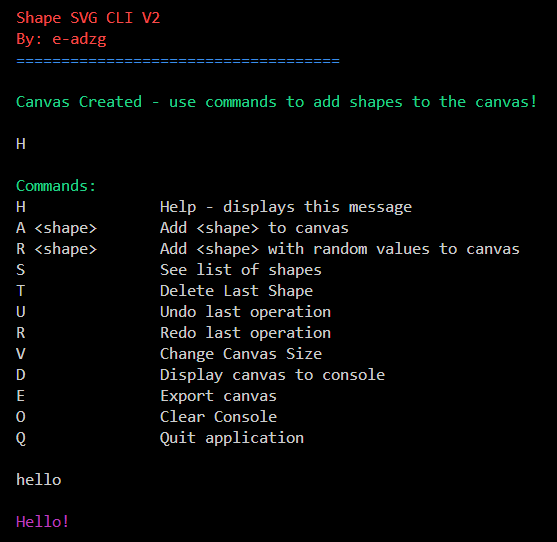

# Shape SVG CLI V2

Use this CLI App to create shapes in SVG format!

Implemented Undo/Redo using the Command Pattern!

V2: More options to create shapes, added abstract factory pattern and error handling!

## PlantUML

C# to PlantUML

Look into include.puml (this has all of the classes)

Export Current Diagram to PDF or PNG
